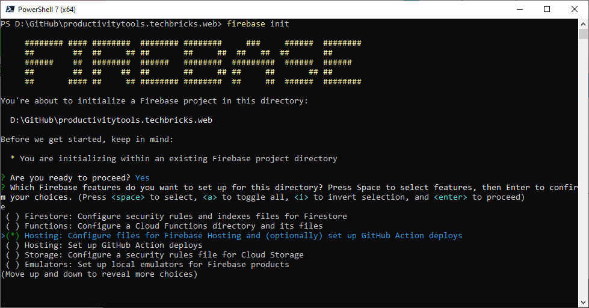
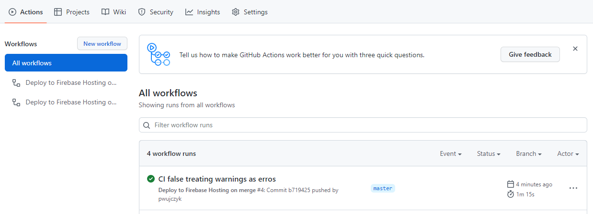

## Deploy to GCP

Hosting static website like react app from the google bucket is very well described [here](https://cloud.google.com/storage/docs/hosting-static-website)

Unfortunatelly we need to have Cloud Load Balancing service enabled to make it working. 
To be validated [This makes the hosting on GCP not cost effective](https://cloud.google.com/vpc/network-pricing#lb)

https://levelup.gitconnected.com/how-to-deploy-react-applications-to-google-cloud-storage-59ac226409d6


```
yarn build 
gsutil rsync -R ./build gs://pttechbricksweb/
```

## Deploy application to firebase hosting
https://hackernoon.com/how-to-deploy-a-react-application-with-firebase-hosting-p92m37b7

```
yarn install firebase-tools
firebase login
yarn build
firebase init
```



```
? What do you want to use as your public directory? -  build
Configure as a single-page app (rewrite all urls to /index.html)?
Set up automatic builds and deploys with GitHub? - Y
? File build/index.html already exists. Overwrite? (y/N) - N
? Set up the workflow to run a build script before every deploy? (y/N) - y
? What script should be run before every deploy? (npm ci && npm run build) - yarn install && yarn build
```

```
firebase deploy
```

### Treating warnings as erros issue during github build

```
name: Deploy to Firebase Hosting on PR
env:
  CI: false
'on': pull_request
jobs:
  build_and_preview:
    if: '${{ github.event.pull_request.head.repo.full_name == github.repository }}'
    runs-on: ubuntu-latest
    steps:
      - uses: actions/checkout@v2
      - run: yarn install && yarn build
      - uses: FirebaseExtended/action-hosting-deploy@v0
        with:
          repoToken: '${{ secrets.GITHUB_TOKEN }}'
          firebaseServiceAccount: '${{ secrets.FIREBASE_SERVICE_ACCOUNT_PTTECHBRICKSAPI_347809 }}'
          projectId: pttechbricksapi-347809
```




